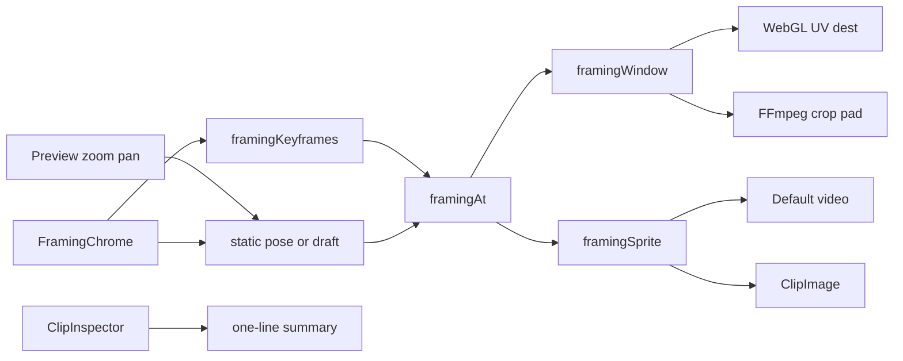

# Requirements

### Overview & Goals
Let users animate how a visual clip is framed inside the movie frame: zoom and pan over time, with keyframes that are either **Smooth** (linear) or **Instant** (hold, then jump).

This replaces the Clip Inspector **Offset X / Offset Y** sliders. Pose on the preview (wheel/pinch/drag); **commit on preview chrome** (save / delete / interpolation). Default and WebGL must show the same framing. The inspector only keeps a one-line summary so it does not steal preview height.

### Scope
#### In Scope
- Image and video clips on `VIDEO` tracks (the same clips that today have Offset X/Y).
- Preview gestures: wheel/pinch zoom and drag-pan to pose the selected clip.
- Preview chrome bar (inside the preview panel, below the movie frame): zoom/pan readout, Save/Delete, Smooth vs Instant, keyframe chips.
- Clip Inspector: one-line Framing summary only — no sliders, no Save/Delete. This is required so the inspector stops eating ~60% of the preview column.
- Live preview (Default + WebGL) using the **same** interpolated pose. They must match, including zoom-out revealing previously cropped pixels.
- FFmpeg export using the same pose.
- Zoom-out below 100% with letterboxing once the whole source is visible.
- Backward compatible: existing `offsetX`/`offsetY` remain the no-keyframe pose at zoom 100%.

#### Out of Scope
- Text elements, description cards, captions, and audio tracks.
- Rotation, 3D perspective, or Ken-Burns presets.
- Auto-key while dragging (keyframes are explicit Save actions on the preview chrome).
- A volume-style envelope canvas for zoom-over-time.
- Framing chrome in fullscreen playback.
- Compose controls drawn on top of the Default DOM `<video>` (it sits above Compose; chrome docks below the frame instead).

### User Stories
- As an editor, I want to zoom and pan a still or video on the preview so I can frame the shot by eye.
- As an editor, I want to save and delete a keyframe from a thin bar on the preview so I can commit a pose without a tall inspector.
- As an editor, I want each keyframe to be Smooth or Instant so I can mix a slow push-in with a hard cut in framing.
- As an editor, I want zoom-out to show more of the source (then letterbox) so I am not stuck inside today’s cover-crop.
- As an editor, I want Default and WebGL to show the same frame so switching renderer does not change the crop.
- As an editor, I want the clip inspector to stay short so the preview stays large.
- As an editor, I want old movies to look unchanged until I touch framing.

### Functional Requirements
- **Pose:** `zoom` (1.0 = today’s cover-crop), `panX`/`panY` (0–100, 50 = center, same meaning as today’s offsets).
- **Range:** zoom **0.25–4.0** (25%–400%). Pan always 0–100.
- **No keyframes:** static `zoom` + `offsetX`/`offsetY` apply for the whole clip (volume-style dual).
- **With keyframes:** `framingAt(clipSeconds)` interpolates. Before the first and after the last keyframe, hold that edge pose.
- **Smooth:** linear from this keyframe’s pose to the next.
- **Instant:** hold this keyframe’s pose until the next keyframe’s time, then jump.
- **Preview chrome commits keyframes:** Save / Delete / Smooth-Instant live on a thin bar in `PreviewPanel` (below the movie frame, above transport). Gestures change the live pose; they do not write keyframes until Save.
- **Inspector is a summary only:** for framable clips, `ClipInspector` shows one line (e.g. `Framing 150% · 2 keys`). No Zoom/Pan sliders, no Save/Delete. Identity / Transition / Volume stay as they are.
- **Static pose (no keyframes):** preview gestures edit `zoom`/`offsetX`/`offsetY` and persist on gesture end (wheel still 300 ms debounce). This *is* the replacement for Offset X/Y.
- **Animated (has keyframes):** preview gestures adjust a draft pose shown while the clip is selected and paused; **Save keyframe** on the chrome upserts at the playhead; playback uses `framingAt` only.
- **Default matches WebGL:** Default `<video>` is laid out as a cover-fitted sprite × zoom, cropped by the overflow-hidden wrap — same picture as `framingWindow` / `ClipImage`. No `object-fit: cover` + CSS `scale`.
- **Delete** removes the keyframe nearest the playhead (same ~hit radius idea as volume points). Deleting the last keyframe writes that pose back into the static fields so the picture does not jump.
- **Copy:** `Duplicate` already copies `effectsConfig`; framing rides along.
- User-facing copy says **Movie**, never Film. Feature name: **Framing**.

### Non-Functional Requirements
- Preview and FFmpeg must share `framingAt()` so a Smooth zoom matches the export.
- Default and WebGL must match each other for framing (zoom-in, pan, and zoom-out). WebGL is no longer allowed to be “the accurate one” here.
- Gesture updates must not hit the network every pointer move (`updateClipLocal` during drag, `updateClip` on end; wheel commits after a 300 ms idle).
- Clickable chrome/inspector controls clip to their shape (project UI rule).
- Preview chrome must stay clickable in Default mode: do not place it under the DOM `<video>` overlay.

# Technical Design

### Current Implementation
Steps 1–3 landed the model, inspector sliders, preview gestures, Compose stills, and WebGL `framingWindow`. Two product issues remain, plus FFmpeg:
- **Default video mismatch:** `setPreviewObjectPosition` still does `object-position` + CSS `transform: scale(zoom)` from center on an `object-fit: cover` `<video>` (`PlatformBridge.js.kt` / `VideoPlayer.js.kt`). Zoom is around frame center, not the pan point; zoom-out scales the already-cropped picture and does not reveal source pixels. WebGL and `ClipImage` (`CoverZoomContentScale` + `BiasAlignment`) already follow the sprite / `framingWindow` model.
- **Inspector height:** `FramingControls` in `ClipInspector.kt` stacks Zoom / Pan X / Pan Y sliders plus Save/Delete/chips. `EditorScreen` places `ClipInspector` under `PreviewPanel` with no height cap, so the preview shrinks.
- **FFmpeg** still uses the three static `crop=(iw-ow)*ox` sites in `FFmpegService.kt`.
- Gestures, `AppViewModel.framingDraft`, `previewFramingPose`, wheel 300 ms debounce, and WebGL CSV stride 13 are done and should be preserved.

### Key Decisions
- **Same picture, two implementations.** WebGL/FFmpeg keep cover-crop UVs via `framingWindow`. Default video and Compose stills use the **equivalent sprite**: cover-fitted source × zoom, panned, clipped to the frame. At zoom 1 + pan 50/50 this is today’s cover-crop; zoom-out reveals cropped pixels then letterboxes.
- **Volume-style dual fields.** Keep `offsetX`/`offsetY`; static `zoom` + `framingKeyframes`. Empty keyframes → static pose. Existing movies stay at zoom 1.0 + their offsets.
- **Preview chrome commits keyframes.** Save/Delete/Smooth-Instant move out of the inspector onto a thin bar in the preview panel. Inspector is summary-only so it stays short.
- **Per-keyframe interpolation** (`SMOOTH` | `INSTANT`) on the outgoing segment, like After Effects Hold vs Linear.
- **Zoom-out allowed** (0.25–4.0) on every path, including Default video.
- **Chrome placement.** Default `<video>` is `position: absolute` above Compose, so the bar docks **below the aspect-constrained frame** (still inside the rounded preview chrome), not over the pixels. Video bounds already come from the inner stage `onGloballyPositioned`, so shrinking that stage to make room for the bar keeps them aligned.

### Proposed Changes
**1. Core pose + interpolation** (`Models.kt`)
Add `FramingPoint`, `FramingInterpolation`, `zoom`, `framingKeyframes`, and `framingAt()` (mirror `volumeAt`, but lerp zoom/pan and honor Instant as a step).

Add `framingWindow(...)` in core: given source aspect, frame aspect, and a pose, return the cover-crop UV rect **and** a dest rect in frame fractions. Zoom 1 + pan 50/50 must match today’s crop exactly. Renderers do not reimplement this.

**2. Inspector → summary** (`ClipInspector.kt`)
Remove `FramingControls` sliders / Save / Delete / chips. For framable clips only, show a short summary column (~140 dp, one or two lines): `Framing` + current zoom % and key count. Reuse `previewFramingPose` for the number. Identity / Transition / Volume unchanged so the inspector returns to pre-framing height.

**3. Preview chrome** (`PreviewPanel.kt`, `AppViewModel.kt`)
Inside the rounded preview `Box`, column-layout the aspect-constrained stage above a ~36 dp `FramingChrome` bar. Show the bar only when a framable clip is selected, paused, and not fullscreen.
- Readout: live zoom % and pan.
- Save / Delete / Smooth / Instant, plus compact keyframe chips that seek.
- Reuse existing `upsertFramingKeyframe`, `deleteNearestFramingKeyframe`, `setFramingKeyframeInterpolation` (keep them `internal` in `ClipInspector.kt` or move next to the VM).
- Clip each clickable with `Modifier.clip` before `clickable`.
- Gestures stay on the inner stage; the bar consumes its own clicks so drag-pan does not steal Save.

**4. Default video sprite** (`VideoPlayer.js.kt` / wasm, `PlatformBridge.js.kt` / wasm)
Replace `object-fit: cover` + `object-position` + `transform: scale(zoom)`.
On pose change, wrap resize, and `loadedmetadata`:
- `cover = max(frameW / videoWidth, frameH / videoHeight)`
- `dispW = videoWidth * cover * zoom`, `dispH = videoHeight * cover * zoom`
- `left = (frameW - dispW) * panX/100`, `top = (frameH - dispH) * panY/100`
- Video: explicit px size/position, `object-fit: fill`, **no** CSS scale. Wrap: `overflow: hidden`, black background (letterbox).
- Zoom 1 + pan 50/50 must match today’s cover-crop.
- Add Kotlin `framingSprite(pose, sourceAspect, frameW, frameH)` next to `framingWindow` as the spec; JS mirrors it (same pattern as the WebGL JS `framingWindow` copy). Relayout when metadata arrives (videoWidth may be 0 at first).
- Wrap slide/fade/circle transitions stay on `#compose-video-preview-wrap`; do not put transforms on the video element.
- Compose stills already match via `CoverZoomContentScale`; leave them unless a golden disagrees with `framingWindow`.
- WebGL path is done (stride 13, UV + dest). Do not regress js/wasm lockstep.

**5. FFmpeg** (`FFmpegService.kt`)
Replace the three static crop lines with a helper that:
- cover-scales as today,
- `crop` with `eval=frame` expressions for `w/h/x/y` from `framingAt` (Smooth = piecewise linear like `volumeEnvelopeExpression`; Instant = `if` step),
- `pad` to the canvas when the crop is smaller than the frame (zoom-out).
Still images use the same expressions on the looped still.

### Data Models / Contracts
```kotlin
enum class FramingInterpolation { SMOOTH, INSTANT }

@Serializable
data class FramingPoint(
    val time: Double,          // clip-local seconds
    val zoom: Double,          // 1.0 = cover
    val panX: Double,          // 0..100, 50 = center
    val panY: Double,
    val interpolation: FramingInterpolation = FramingInterpolation.SMOOTH
)

// EffectsConfig additions (offsetX/offsetY kept)
val zoom: Double = 1.0
val framingKeyframes: List<FramingPoint> = emptyList()

fun EffectsConfig.framingAt(clipSeconds: Double): FramingPose
// empty keyframes → FramingPose(zoom, offsetX, offsetY)
// Instant: hold outgoing pose until next.time

data class FramingWindow(
    val u0: Double, val v0: Double, val u1: Double, val v1: Double, // source UV
    val dx: Double, val dy: Double, val dw: Double, val dh: Double  // dest, frame fractions
)
fun framingWindow(pose: FramingPose, sourceAspect: Double, frameAspect: Double): FramingWindow

// Spec for the Default <video> / ClipImage sprite (equivalent to framingWindow dest).
data class FramingSprite(val x: Double, val y: Double, val w: Double, val h: Double) // CSS px in the wrap
fun framingSprite(pose: FramingPose, sourceAspect: Double, frameW: Double, frameH: Double): FramingSprite

const val MIN_FRAMING_ZOOM = 0.25
const val MAX_FRAMING_ZOOM = 4.0
```

`parseEffectsConfig` already `ignoreUnknownKeys`; new fields default on old JSON. Encoder will start writing `zoom` / `framingKeyframes` when set.

### Components
- **`EffectsConfig` / `framingAt` / `framingWindow` / `framingSprite`** — single source of truth.
- **`ClipInspector` Framing summary** — one-line zoom/key count; sliders gone.
- **`FramingChrome`** in `PreviewPanel` — Save/Delete/Smooth-Instant/chips + readout, below the frame.
- **`PreviewPanel` stage gestures + `framingDraft`** — already landed; keep wheel debounce.
- **`ClipImage`** — `CoverZoomContentScale` + `BiasAlignment` (already sprite-equivalent).
- **`VideoPlayer` + `setPreviewObjectPosition`** — sprite layout from `framingSprite`, js and wasm.
- **`WebGLPreviewLayer` + js/wasm compositors** — already UV + letterbox (stride 13).
- **`FFmpegService` crop/pad** — time-varying crop (remaining).
- **`AppViewModel`** — draft, local-drag, wheel commit; chrome reuses the same helpers.

### File Structure
- Modify: `core/src/commonMain/kotlin/app/moviestudio/Models.kt`
- Modify: `core/src/commonTest/kotlin/app/moviestudio/ModelsTest.kt`
- Modify: `app/shared/src/commonMain/kotlin/app/moviestudio/ui/ClipInspector.kt`
- Modify: `app/shared/src/commonMain/kotlin/app/moviestudio/ui/PreviewPanel.kt`
- Modify: `app/shared/src/commonMain/kotlin/app/moviestudio/AppViewModel.kt`
- Modify: `app/shared/src/commonMain/kotlin/app/moviestudio/WebGLPreview.kt`
- Modify: `app/shared/src/commonMain/kotlin/app/moviestudio/PlatformBridge.kt` (+ js/wasm/jvm/android expects)
- Modify: `app/shared/src/jsMain/.../WebGLPreview.js.kt`, `VideoPlayer.js.kt`, `PlatformBridge.js.kt`
- Modify: `app/shared/src/wasmJsMain/...` counterparts
- Modify: `server/src/main/kotlin/app/moviestudio/service/FFmpegService.kt`
- Modify: `server/src/test/kotlin/app/moviestudio/FFmpegServiceErrorTest.kt` (expression helper, like volume)
- Modify: `docs/PreviewPanel.md` (crop model → framing window)

### Architecture Diagram


### Risks
- **Default `<video>` z-index.** The shared video is a DOM overlay above Compose, so on-stage buttons would be invisible and unclickable. Mitigation: dock `FramingChrome` below the inner stage inside the preview chrome; video bounds follow the inner stage.
- **videoWidth is 0 until metadata.** Sprite layout would collapse. Mitigation: keep cover-fit 100% until `loadedmetadata`, then relayout; same on wrap resize.
- **Sprite vs UV drift.** JS sprite math must stay equivalent to `framingWindow`. Mitigation: Kotlin `framingSprite` goldens vs `framingWindow` dest; comment the JS mirror.
- **Gesture clashes.** Stage-only `pointerInput`; chrome clicks must not start a pan. Wheel still debounced (300 ms).
- **FFmpeg expression size.** Many keyframes → long `crop` expr. Mitigation: nested-`if` like volume.
- **WebGL CSV stride.** Already 13; js and wasm must stay in lockstep.

# Testing

### Validation Approach
Core interpolation, `framingWindow`, and `framingSprite` are unit-tested in `ModelsTest.kt`. FFmpeg helper expressions get parser-level tests like `volumeEnvelopeExpression`. UI/preview checks are scenario-based (inspector height, chrome Save/Delete, Default sprite vs window dest), not screenshot tests.

### Key Scenarios
- No keyframes: `framingAt` returns static `zoom` + `offsetX`/`offsetY`; zoom 1 + pan 50/50 matches today’s crop.
- Two Smooth keyframes: zoom/pan lerp at mid-span; hold before first and after last.
- Instant keyframe: pose holds until the next keyframe time, then jumps.
- `framingWindow` at zoom 1 equals current WebGL/FFmpeg cover UV for both wide and tall sources.
- Zoom-out past contain: UV is full source, dest rect is letterboxed and pan-able.
- `framingSprite` dest size/origin matches `framingWindow` dest for zoom 1 / 2 / 0.5 on 16:9 and 9:16 sources.
- Chrome Save upserts at playhead; second save at the same time updates pose/interpolation instead of duplicating.
- Delete last keyframe restores static fields to that pose.
- Inspector no longer contains Zoom/Pan sliders; summary is one/two lines.
- Old JSON without `zoom`/`framingKeyframes` still parses (defaults).

### Edge Cases
- Unsorted keyframes are sorted by time (mirror volume).
- Playhead outside the clip: chrome Save is disabled or clamped to `[0, clipLength]`.
- Zero-length span between two keyframes: Instant/Smooth both return the later pose.
- Text / description clips never show framing chrome/summary and never apply a window.
- Chrome hidden while playing, in fullscreen, and when the selection is not a framable visual.
- Default video with unknown dimensions (videoWidth 0) does not collapse the picture.

### Test Changes
- Existing `framingAt` / `framingWindow` tests stay.
- Add `framingSprite` goldens next to `framingWindow` (16:9 on 16:9, 9:16 on 16:9, zoom 1 / 2 / 0.5) asserting sprite rect ≡ window dest × frame size.
- Keep chrome helper tests (`upsert` / `delete-last` / hit radius) — they move with the helpers if relocated.
- Extend `FFmpegServiceErrorTest.kt` with crop-expression Smooth vs Instant cases.
- No new Compose UI test framework; inspector height and Default/WebGL parity verified by the scenarios above during implementation.

# Delivery Steps

### ✓ Step 1: Add framing data model and interpolation
Core can evaluate a framing pose over time and a cover-crop UV/dest window, with tests; old movies still parse as zoom 1 + existing offsets.

- Add `FramingInterpolation`, `FramingPoint`, `FramingPose`, static `zoom` (default 1.0) and `framingKeyframes` on `EffectsConfig` in `core/src/commonMain/kotlin/app/moviestudio/Models.kt`.
- Implement `framingAt(clipSeconds)` mirroring `volumeAt`: empty list → static zoom/offsetX/offsetY; Smooth lerps zoom and pan; Instant holds the outgoing pose until the next time.
- Implement `framingWindow(pose, sourceAspect, frameAspect)` so zoom 1 + pan 50/50 matches today’s FFmpeg/WebGL cover-crop; zoom-out past contain returns a letterboxed dest rect and full-source UVs.
- Clamp zoom to `MIN_FRAMING_ZOOM`/`MAX_FRAMING_ZOOM` (0.25–4.0).
- Add unit tests in `ModelsTest.kt` for static fallback, Smooth lerp, Instant step, unsorted keyframes, and window goldens for wide/tall sources.

### ✓ Step 2: Replace Offset sliders with inspector framing controls
Offset X/Y sliders are gone; framing helpers (`upsert` / `delete-last` / hit radius) and tests exist. The tall slider column will be replaced by a one-line summary in Step 5.

### ✓ Step 3: Preview posing and live cover-crop framing
Gestures, `framingDraft`, `previewFramingPose`, `ClipImage` sprite scale, WebGL `framingWindow` (CSV stride 13, js+wasm), and 300 ms wheel debounce are in. Default video still uses CSS cover+scale and does **not** yet match WebGL.

### ✓ Step 4: Sprite Default video so it matches WebGL
Default `<video>` scale-and-crops like `framingWindow` / `ClipImage`, including zoom-out revealing previously cropped pixels.

- Add `framingSprite(pose, sourceAspect, frameW, frameH)` in `Models.kt` and goldens in `ModelsTest.kt` that match `framingWindow` dest × frame size (16:9 and 9:16, zoom 1 / 2 / 0.5).
- Rewrite `setPreviewObjectPosition` in `PlatformBridge.js.kt` and `PlatformBridge.wasmJs.kt`: drop `object-fit: cover` + `transform: scale`; size/position the video from `framingSprite` using `videoWidth`/`videoHeight`; `object-fit: fill`; wrap `overflow: hidden`.
- Relayout on pose change, wrap resize, and `loadedmetadata` (do not layout at 0×0).
- Keep wrap-level fade/slide/circle; do not transform the video element.
- Zoom 1 + pan 50/50 must match today’s cover-crop. Compile js + wasm.

### ✓ Step 5: Preview framing chrome and shrink the inspector
Framing Save/Delete/interpolation live on a thin preview bar; `ClipInspector` is a one-line summary so the preview column gets its height back.

- In `PreviewPanel.kt`, column-layout the aspect-constrained stage above a ~36 dp `FramingChrome` (readout, Save, Delete, Smooth/Instant, chips). Visible only for a selected framable clip while paused and not fullscreen.
- Wire chrome to existing `upsertFramingKeyframe` / `deleteNearestFramingKeyframe` / `setFramingKeyframeInterpolation` and `framingDraft`.
- Clip clickable chrome controls to shape. Stage gestures stay on the inner box.
- Replace `FramingControls` in `ClipInspector.kt` with a short summary (`Framing 150% · 2 keys`). No sliders.
- Confirm `EditorScreen` preview + inspector stack no longer gives the inspector a three-slider column.

### ✓ Step 6: Animate FFmpeg crop to match framingAt
Exported movies use the same interpolated framing as the WebGL preview, including zoom-out padding.

- Replace the three static `crop=(iw-ow)*ox` sites in `FFmpegService.kt` with one helper that cover-scales, then `crop` with `eval=frame` from `framingAt` (Smooth piecewise-linear like `volumeEnvelopeExpression`, Instant as an `if` step).
- When the crop is smaller than the canvas (zoom-out), `pad` to canvas so letterboxing matches `framingWindow`.
- Apply the same chain to still-image segments (looped stills).
- Add expression tests in `FFmpegServiceErrorTest.kt` for Smooth lerp and Instant hold.
- Update `docs/PreviewPanel.md` so the compositing model describes the framing window / sprite instead of static offsets.