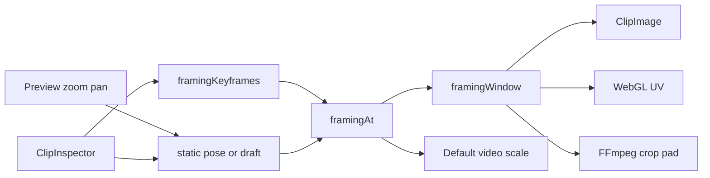

# Requirements

### Overview & Goals
Let users animate how a visual clip is framed inside the movie frame: zoom and pan over time, with keyframes that are either **Smooth** (linear) or **Instant** (hold, then jump).

This replaces the Clip Inspector **Offset X / Offset Y** sliders. Framing is authored on the preview (live zoom/pan) but **committed in the inspector** (save / delete / interpolation).

### Scope
#### In Scope
- Image and video clips on `VIDEO` tracks (the same clips that today have Offset X/Y).
- Preview overlay: wheel/pinch zoom and drag-pan to pose the selected clip.
- Clip Inspector: zoom/pan numbers, save/delete keyframe at the playhead, Smooth vs Instant per keyframe, keyframe chips.
- Live preview (Default + WebGL) and FFmpeg export using the same interpolated pose.
- Zoom-out below 100% with letterboxing (black bars) once the whole source is visible.
- Backward compatible: existing `offsetX`/`offsetY` remain the no-keyframe pose at zoom 100%.

#### Out of Scope
- Text elements, description cards, captions, and audio tracks.
- Rotation, 3D perspective, or Ken-Burns presets.
- Auto-key while dragging (keyframes are explicit inspector actions).
- A volume-style envelope canvas for zoom-over-time.
- Changing fullscreen playback chrome.

### User Stories
- As an editor, I want to zoom and pan a still or video on the preview so I can frame the shot by eye.
- As an editor, I want to save a keyframe at the playhead and delete it later so I can build a zoom that starts and ends where I choose.
- As an editor, I want each keyframe to be Smooth or Instant so I can mix a slow push-in with a hard cut in framing.
- As an editor, I want zoom-out to show more of the source (then letterbox) so I am not stuck inside today’s cover-crop.
- As an editor, I want old movies to look unchanged until I touch framing.

### Functional Requirements
- **Pose:** `zoom` (1.0 = today’s cover-crop), `panX`/`panY` (0–100, 50 = center, same meaning as today’s offsets).
- **Range:** zoom **0.25–4.0** (25%–400%). Pan always 0–100.
- **No keyframes:** static `zoom` + `offsetX`/`offsetY` apply for the whole clip (volume-style dual).
- **With keyframes:** `framingAt(clipSeconds)` interpolates. Before the first and after the last keyframe, hold that edge pose.
- **Smooth:** linear from this keyframe’s pose to the next.
- **Instant:** hold this keyframe’s pose until the next keyframe’s time, then jump.
- **Inspector is source of truth:** Save / Delete / Smooth-Instant live only in `ClipInspector`. Preview gestures change the live pose; they do not write keyframes.
- **Static pose (no keyframes):** preview gestures and inspector sliders both edit `zoom`/`offsetX`/`offsetY` and persist on gesture end / slider change (this *is* the replacement for Offset X/Y).
- **Animated (has keyframes):** preview gestures adjust a draft pose shown while the clip is selected and paused; **Save keyframe** upserts at the playhead; playback uses `framingAt` only.
- **Delete** removes the keyframe nearest the playhead (same ~hit radius idea as volume points). Deleting the last keyframe writes that pose back into the static fields so the picture does not jump.
- **Copy:** `Duplicate` already copies `effectsConfig`; framing rides along.
- User-facing copy says **Movie**, never Film. Feature name: **Framing**.

### Non-Functional Requirements
- Preview and FFmpeg must share `framingAt()` so a Smooth zoom matches the export.
- WebGL remains the accurate preview (already the product rule vs Default).
- Gesture updates must not hit the network every pointer move (`updateClipLocal` during drag, `updateClip` on end), matching timeline drags.
- Clickable inspector controls clip to their shape (project UI rule).

# Technical Design

### Current Implementation
Visual framing is a **static cover-crop**:
- `EffectsConfig.offsetX` / `offsetY` (0–100, 50 = center) in `core/.../Models.kt`.
- Inspector sliders in `ClipInspector.kt` (~lines 187–205).
- Compose stills: `ClipImage` uses `ContentScale.Crop` + `BiasAlignment`.
- Default video: shared `<video>` with `object-fit: cover` and `setPreviewObjectPosition` (`VideoPlayer.js.kt`, `PlatformBridge.js.kt`).
- WebGL: cover UV window `uUvScale` / `uUvOffset` from `offsetX/Y` (`WebGLPreview.js.kt` / `WebGLPreview.wasmJs.kt`).
- FFmpeg: `scale=...:force_original_aspect_ratio=increase` then `crop=W:H:(iw-ow)*ox:(ih-oh)*oy` in three places in `FFmpegService.kt` (~1021, ~1286, ~1458).

The pattern to copy for animation is **volume**: flat `volume` + `volumeKeyframes`, `volumeAt()`, inspector commit, FFmpeg `volumeEnvelopeExpression` with `eval=frame`.

### Key Decisions
- **Cover-crop UVs, not a free sprite.** Zoom shrinks/grows the sampled window on the cover-fitted source. When the window would exceed the source, letterbox (dest rect smaller than the frame, UV = full image). Chosen over a sprite-transform pipeline.
- **Volume-style dual fields.** Keep `offsetX`/`offsetY`; add static `zoom` and `framingKeyframes`. Empty keyframes → static pose. Existing movies stay at zoom 1.0 + their offsets.
- **Inspector commits keyframes.** Preview is for posing; Save/Delete/Smooth-Instant are inspector actions.
- **Per-keyframe interpolation** (`SMOOTH` | `INSTANT`) on the outgoing segment, like After Effects Hold vs Linear.
- **Zoom-out allowed** (0.25–4.0). Default DOM `<video>` cannot reveal extra pixels with `object-fit: cover` + CSS scale; WebGL + FFmpeg + Compose stills will. That matches today’s “WebGL = more accurate” split.

### Proposed Changes
**1. Core pose + interpolation** (`Models.kt`)
Add `FramingPoint`, `FramingInterpolation`, `zoom`, `framingKeyframes`, and `framingAt()` (mirror `volumeAt`, but lerp zoom/pan and honor Instant as a step).

Add `framingWindow(...)` in core: given source aspect, frame aspect, and a pose, return the cover-crop UV rect **and** a dest rect in frame fractions. Zoom 1 + pan 50/50 must match today’s crop exactly. Renderers do not reimplement this.

**2. Inspector** (`ClipInspector.kt`)
For `TrackType.VIDEO` image/video assets, replace the Offset X/Y column with a **Framing** block: zoom slider, pan X/Y sliders, Save keyframe, Delete, Smooth/Instant (enabled when a keyframe sits at/near the playhead), and compact keyframe chips. Text/description clips keep no framing UI.

**3. Preview posing** (`PreviewPanel.kt`, `AppViewModel.kt`)
When the selected clip is a framable visual and the pointer is on the stage: wheel/pinch zooms, drag pans. `clipToBounds` already on the stage keeps overflow hidden.
- No keyframes: `updateClipLocal` while dragging, `updateClipEffects` on end.
- Has keyframes: write `framingDraft` on the VM; inspector Save reads it.

Evaluate `framingAt(playhead - clip.timelineStart)` (or draft) for every visual layer.

**4. Apply the window (cover-crop UV)**
- **Compose stills (`ClipImage`):** custom `ContentScale` = cover × zoom, `BiasAlignment` from pan, parent already `clipToBounds`. This *does* reveal source on zoom-out.
- **Default `<video>`:** extend `setPreviewObjectPosition` with zoom; `object-position` for pan, `transform: scale(zoom)` for zoom-in. Zoom-out letterboxes the element and does **not** reveal cropped pixels (known Default gap).
- **WebGL:** pass `zoom` on `WebGLPreviewLayer` (CSV grows by one float; update **js and wasm**). Shader/draw path uses `framingWindow`: shrink UV on zoom-in; when UV would exceed 0–1, draw a smaller quad (letterbox) with UV 0–1.
- Transitions (fade/slide/circle) stay on the **frame**, not the crop window — same order as today (crop first, then transition).

**5. FFmpeg** (`FFmpegService.kt`)
Replace the three static crop lines with a helper that:
- cover-scales as today,
- `crop` with `eval=frame` expressions for `w/h/x/y` from `framingAt` (Smooth = piecewise linear like `volumeEnvelopeExpression`; Instant = `if` step),
- `pad` to the canvas when the crop is smaller than the frame (zoom-out).
Still images use the same expressions on the looped still.

### Data Models / Contracts
```kotlin
enum class FramingInterpolation { SMOOTH, INSTANT }

@Serializable
data class FramingPoint(
    val time: Double,          // clip-local seconds
    val zoom: Double,          // 1.0 = cover
    val panX: Double,          // 0..100, 50 = center
    val panY: Double,
    val interpolation: FramingInterpolation = FramingInterpolation.SMOOTH
)

// EffectsConfig additions (offsetX/offsetY kept)
val zoom: Double = 1.0
val framingKeyframes: List<FramingPoint> = emptyList()

fun EffectsConfig.framingAt(clipSeconds: Double): FramingPose
// empty keyframes → FramingPose(zoom, offsetX, offsetY)
// Instant: hold outgoing pose until next.time

data class FramingWindow(
    val u0: Double, val v0: Double, val u1: Double, val v1: Double, // source UV
    val dx: Double, val dy: Double, val dw: Double, val dh: Double  // dest, frame fractions
)
fun framingWindow(pose: FramingPose, sourceAspect: Double, frameAspect: Double): FramingWindow

const val MIN_FRAMING_ZOOM = 0.25
const val MAX_FRAMING_ZOOM = 4.0
```

`parseEffectsConfig` already `ignoreUnknownKeys`; new fields default on old JSON. Encoder will start writing `zoom` / `framingKeyframes` when set.

### Components
- **`EffectsConfig` / `framingAt` / `framingWindow`** — single source of truth (new).
- **`ClipInspector` Framing block** — replaces Offset X/Y (existing).
- **`PreviewPanel` stage gestures + draft** — new interaction on the existing stage `Box`.
- **`ClipImage`** — custom scale/alignment (existing).
- **`VideoPlayer` + `setPreviewObjectPosition`** — add zoom (existing Default path).
- **`WebGLPreviewLayer` + js/wasm compositors** — UV + letterbox quad (existing).
- **`FFmpegService` crop/pad** — time-varying crop (existing).
- **`AppViewModel.updateClipEffects`** — unchanged persistence path; add draft + local-drag helpers.

### File Structure
- Modify: `core/src/commonMain/kotlin/app/moviestudio/Models.kt`
- Modify: `core/src/commonTest/kotlin/app/moviestudio/ModelsTest.kt`
- Modify: `app/shared/src/commonMain/kotlin/app/moviestudio/ui/ClipInspector.kt`
- Modify: `app/shared/src/commonMain/kotlin/app/moviestudio/ui/PreviewPanel.kt`
- Modify: `app/shared/src/commonMain/kotlin/app/moviestudio/AppViewModel.kt`
- Modify: `app/shared/src/commonMain/kotlin/app/moviestudio/WebGLPreview.kt`
- Modify: `app/shared/src/commonMain/kotlin/app/moviestudio/PlatformBridge.kt` (+ js/wasm/jvm/android expects)
- Modify: `app/shared/src/jsMain/.../WebGLPreview.js.kt`, `VideoPlayer.js.kt`, `PlatformBridge.js.kt`
- Modify: `app/shared/src/wasmJsMain/...` counterparts
- Modify: `server/src/main/kotlin/app/moviestudio/service/FFmpegService.kt`
- Modify: `server/src/test/kotlin/app/moviestudio/FFmpegServiceErrorTest.kt` (expression helper, like volume)
- Modify: `docs/PreviewPanel.md` (crop model → framing window)

### Architecture Diagram


### Risks
- **Default vs WebGL zoom-out mismatch.** Default `<video>` + CSS scale cannot reveal cover-cropped pixels. Mitigation: document it; WebGL/export stay correct; Compose stills use custom `ContentScale` so images *are* accurate on Default.
- **Gesture clashes.** Wheel zoom must `preventDefault` on the stage only, not the whole page; drag-pan must not steal timeline drags (stage-only `pointerInput`).
- **FFmpeg expression size.** Many keyframes → long `crop` expr. Mitigation: same nested-`if` style as volume; clamp to a reasonable keyframe count in UI if needed.
- **Source aspect unknown in Kotlin.** `Asset` has no width/height. Pose stays aspect-agnostic; `framingWindow` runs where dimensions exist (GL draw, FFmpeg, Compose layout).
- **WebGL CSV layout.** Frame CSV is a fixed 12-float stride today; js and wasm must bump together or ticks are dropped.

# Testing

### Validation Approach
Core interpolation and window math are unit-tested (same style as `volumeAt` in `ModelsTest.kt`). FFmpeg helper expressions get parser-level tests like `volumeEnvelopeExpression`. UI/preview checks are scenario-based against the inspector and stage, not screenshot tests.

### Key Scenarios
- No keyframes: `framingAt` returns static `zoom` + `offsetX`/`offsetY`; zoom 1 + pan 50/50 matches today’s crop.
- Two Smooth keyframes: zoom/pan lerp at mid-span; hold before first and after last.
- Instant keyframe: pose holds until the next keyframe time, then jumps.
- `framingWindow` at zoom 1 equals current WebGL/FFmpeg cover UV for both wide and tall sources.
- Zoom-out past contain: UV is full source, dest rect is letterboxed and pan-able.
- Inspector Save upserts at playhead; second save at the same time updates pose/interpolation instead of duplicating.
- Delete last keyframe restores static fields to that pose.
- Old JSON without `zoom`/`framingKeyframes` still parses (defaults).

### Edge Cases
- Unsorted keyframes are sorted by time (mirror volume).
- Playhead outside the clip: inspector Save is disabled or clamped to `[0, clipLength]`.
- Zero-length span between two keyframes: Instant/Smooth both return the later pose.
- Text / description clips never show framing UI and never apply a window.
- Default video zoom-out does not claim to match WebGL (documented limitation).

### Test Changes
- Add `framingAt` tests next to `volumeEnvelopeInterpolatesLinearlyBetweenKeyframes` in `ModelsTest.kt`.
- Add `framingWindow` golden tests (16:9 source on 16:9 frame, 9:16 on 16:9, zoom 1 / 2 / 0.5).
- Extend `FFmpegServiceErrorTest.kt` with crop-expression Smooth vs Instant cases.
- No new Compose UI test framework; inspector/preview verified by the scenarios above during implementation.

# Delivery Steps

### ✓ Step 1: Add framing data model and interpolation
Core can evaluate a framing pose over time and a cover-crop UV/dest window, with tests; old movies still parse as zoom 1 + existing offsets.

- Add `FramingInterpolation`, `FramingPoint`, `FramingPose`, static `zoom` (default 1.0) and `framingKeyframes` on `EffectsConfig` in `core/src/commonMain/kotlin/app/moviestudio/Models.kt`.
- Implement `framingAt(clipSeconds)` mirroring `volumeAt`: empty list → static zoom/offsetX/offsetY; Smooth lerps zoom and pan; Instant holds the outgoing pose until the next time.
- Implement `framingWindow(pose, sourceAspect, frameAspect)` so zoom 1 + pan 50/50 matches today’s FFmpeg/WebGL cover-crop; zoom-out past contain returns a letterboxed dest rect and full-source UVs.
- Clamp zoom to `MIN_FRAMING_ZOOM`/`MAX_FRAMING_ZOOM` (0.25–4.0).
- Add unit tests in `ModelsTest.kt` for static fallback, Smooth lerp, Instant step, unsorted keyframes, and window goldens for wide/tall sources.

### ✓ Step 2: Replace Offset sliders with inspector framing controls
Clip Inspector is the place that saves, deletes, and sets Smooth/Instant keyframes; Offset X/Y sliders are gone for image/video clips.

- Remove the Offset X/Y column in `ClipInspector.kt` for `TrackType.VIDEO`.
- Add a Framing block (image/video assets only, not text/description): zoom slider, pan X/Y sliders, Save keyframe at playhead, Delete nearest keyframe, Smooth/Instant on that keyframe, and compact chips.
- Wire through existing `viewModel.updateClipEffects`.
- No keyframes: sliders write static `zoom`/`offsetX`/`offsetY`.
- Has keyframes: sliders edit a draft pose; Save upserts a `FramingPoint` at clip-local playhead; Delete last keyframe copies pose back to static fields.
- Clip interactive controls with `Modifier.clip` before `clickable` per project UI rules.
- User-facing strings say Framing / Movie, never Film.

### * Step 3: Preview posing and live cover-crop framing
The selected visual can be zoomed and panned on the preview; Default, Compose stills, and WebGL all consume `framingAt` / `framingWindow`.

- In `PreviewPanel.kt`, on the aspect-constrained stage, add wheel/pinch zoom and drag pan for the selected framable clip only (`pointerInput` on the stage, not the page).
- `AppViewModel`: local-drag via `updateClipLocal` when there are no keyframes; `framingDraft` when there are keyframes. Persist with `updateClip` / `updateClipEffects` on gesture end.
- `ClipImage`: custom `ContentScale` = cover × zoom + `BiasAlignment` from pan (zoom-out reveals source, then letterboxes).
- Default video: extend `setPreviewObjectPosition` / `VideoPlayer` with zoom (`object-position` + CSS `scale`); accept that zoom-out does not reveal extra pixels on this path.
- `WebGLPreviewLayer`: add zoom; bump the per-frame CSV stride in **both** `WebGLPreview.js.kt` and `WebGLPreview.wasmJs.kt`; apply `framingWindow` (UV shrink on zoom-in, smaller quad on zoom-out).
- Keep transition fade/slide/circle on the frame, after the crop window.

###   Step 4: Animate FFmpeg crop to match framingAt
Exported movies use the same interpolated framing as the WebGL preview, including zoom-out padding.

- Replace the three static `crop=(iw-ow)*ox` sites in `FFmpegService.kt` with one helper that cover-scales, then `crop` with `eval=frame` from `framingAt` (Smooth piecewise-linear like `volumeEnvelopeExpression`, Instant as an `if` step).
- When the crop is smaller than the canvas (zoom-out), `pad` to canvas so letterboxing matches `framingWindow`.
- Apply the same chain to still-image segments (looped stills).
- Add expression tests in `FFmpegServiceErrorTest.kt` for Smooth lerp and Instant hold.
- Update `docs/PreviewPanel.md` so the compositing model describes the framing window instead of static offsets.