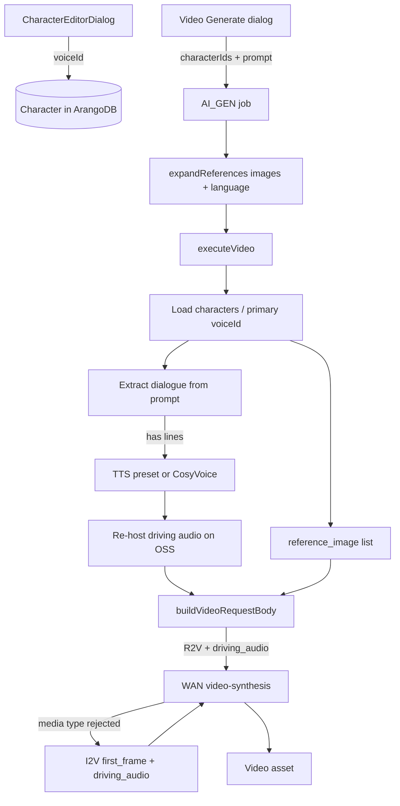

# Requirements

### Overview & Goals

Associate any Voice Library voice (default preset, clone, or design) with a saved character, then use that voice for **in-video speech** when the character is referenced in video generation. Speech content comes from the video prompt: the server synthesizes it with the character’s voice and attaches it as WAN `driving_audio` alongside R2V reference images so the character looks and sounds consistent across clips.

### Scope

#### In Scope
- `Character.voiceId` linking to any Voice Library entry (same id TTS already uses).
- Character editor UI to pick / preview / clear a voice via the existing Voice Library dialog.
- Library list indicator when a character has a linked voice.
- On video generation with voiced character(s): extract dialogue from the prompt → TTS with the character voice → attach as `driving_audio` on the WAN request (R2V preferred; I2V fallback if R2V rejects audio media).
- Docs update (`docs/Voices.md`) describing character↔voice association and the driving-audio path.

#### Out of Scope
- Separate VO-track auto-generation or timeline dubbing as the primary path.
- Explicit multi-speaker dialogue editor / per-line character assignment UI.
- Changing CosyVoice enrollment or the Voice Library itself.
- Renaming internal `Film` types or REST paths.

### User Stories

- As a director, I want to assign Cherry (or a cloned/designed voice) to Captain Mira so every R2V clip of her speaks with the same voice.
- As a director, I want video prompts that include dialogue (e.g. quoted lines) to drive lip-synced speech without a separate dialogue field.
- As a director, I want characters without a voice (or prompts without dialogue) to keep working exactly as today (visual R2V only).

### Functional Requirements

1. **Association** — Character create/edit can set `voiceId` to any preset id / clone `qwenVoiceId` / design `qwenVoiceId`, or clear it. Blank default for existing characters.
2. **Display** — Editor shows a human-readable voice label (reuse `voiceDisplayLabel` pattern). Library row shows that a voice is linked.
3. **Generation** — When `GenerationSetup.kind == "video"` and at least one selected character has a non-blank `voiceId`:
   - Resolve **primary voice** = first selected character (setup `characterIds` order) with a non-blank `voiceId`.
   - Extract spoken text from the prompt (quoted dialogue preferred; lightweight chat extract as fallback; skip audio if none).
   - TTS that text with the primary voice (existing preset vs CosyVoice paths).
   - Re-host audio on OSS and send as `{ "type": "driving_audio", "url": ... }` in `input.media` together with R2V `reference_image` entries.
4. **Fallback** — If Model Studio rejects `driving_audio` on R2V, retry as I2V using the first surviving reference image as `first_frame` + `driving_audio` (keeps speech; may drop multi-ref balance).
5. **Idempotence** — Do not persist the ephemeral driving-audio URL on the asset setup; re-derive from `characterIds` + current `Character.voiceId` on every generation so voice changes apply on regenerate.

### Non-Functional Requirements

- Backward compatible: missing `voiceId` decodes as `""`.
- Graceful degradation when Qwen is not configured (same mock/offline TTS behavior as voice sampling).
- User-facing copy says **Movie**, never Film.
- Clickable voice picker controls use `Modifier.clip(shape)` before `.clickable`.

# Technical Design

### Current Implementation

- **Character** (`core/.../Models.kt`): `name`, `description`, `referenceImages` (max 3), `mainLanguage`, `movieId` — no voice field.
- **Voice Library** (`docs/Voices.md`, `VoicePreset` / `VoiceClone` / `VoiceDesign`): synthesis identity is preset `id` or clone/design `qwenVoiceId`; UI in `GenerateDialogs.kt` (`VoiceLibraryDialog`, `voiceDisplayLabel`).
- **R2V expansion** (`GenerationRoutes.expandReferences`): balances character/scene reference images into `setup.referenceImages` + prompt bindings; injects `mainLanguage` for video.
- **WAN request** (`QwenAIService.buildVideoRequestBody`):
  - R2V media types documented today: `reference_image` | `reference_video` | `first_frame`
  - I2V also documents `driving_audio` (not wired yet)
- **TTS** (`QwenAIService`): preset → multimodal TTS; clone/design → CosyVoice sync path — reused for driving audio.

### Key Decisions

1. **Store synthesis voice id on Character** — `voiceId: String = ""` holds the same string TTS sends as `voice` (preset id or `qwenVoiceId`). No separate FK to clone/design rows so presets work without a DB row.
2. **TTS + `driving_audio` pipeline** — Prompt → dialogue text → TTS with character voice → WAN `driving_audio`, not post-mux dubbing.
3. **Server-side, per job** — Driving audio is produced in `executeVideo` (network/TTS), not in sync `expandReferences`. Ephemeral URL is not stored on `GenerationSetup` for regeneration; character link is the source of truth.
4. **Primary voice only** — First selected character with a voice drives audio; all selected characters still contribute R2V images/prompt text. Multi-speaker scripting is out of scope.
5. **Dialogue extraction** — (a) collect quoted segments from the prompt; (b) if none, one short chat call asking for spoken lines only (empty if none); (c) if still empty, skip `driving_audio` and run visual-only video gen.
6. **R2V-first, I2V fallback** — Prefer R2V media = reference images + `driving_audio`. On media-type rejection, rebuild as I2V (`first_frame` = first ref image + `driving_audio`).

### Architecture Diagram



### Proposed Changes

#### Data model (`core/.../Models.kt`)

```kotlin
data class Character(
    // ...
    val mainLanguage: String = "",
    /** Voice Library synthesis id (preset id or clone/design qwenVoiceId). Blank = none. */
    val voiceId: String = "",
    val movieId: String? = null,
    val createdAt: Long = 0,
)
```

Optional internal helper only on the server job path (not required on `GenerationSetup`):

```kotlin
// passed into buildVideoRequestBody as a parameter, or a short-lived copy:
setup.copy(/* no new persisted field */) + drivingAudioUrl: String?
```

Prefer extending `buildVideoRequestBody(..., drivingAudioUrl: String? = null)` so stored `generationConfig` JSON stays stable.

#### Character editor UI (`CharacterSceneDialogs.kt`)

- After Main language, add a **Voice** section:
  - Label via shared `voiceDisplayLabel(viewModel.voiceOptions, voiceId)` (move helper to a shared place if needed, or duplicate the small resolver next to the editor).
  - `GhostPillButton("🎙 Voice Library")` → existing `VoiceLibraryDialog`.
  - Clear action when `voiceId` is set.
  - Ensure `viewModel.refreshVoices()` when the editor opens if options may be stale.
- Save path includes `voiceId = voiceId.trim()`.

#### Library list (`LibraryPanel.kt`)

- Subtitle appends ` • 🎙 <voice name>` when `voiceId` is set (resolve against `viewModel.voiceOptions`).

#### Video job (`QwenAIService.executeVideo`)

1. After frame resolution / before submit, if `setup.characterIds` is non-empty:
   - Load characters; pick primary with non-blank `voiceId`.
   - `dialogue = extractDialogueForDrivingAudio(setup.prompt)`.
   - If dialogue non-blank: synthesize via existing TTS helpers (same branching as `sampleVoice` / `executeTts`), re-host under `ai-generated/<movieId>/driving-*.mp3`, record ledger entries.
2. Call `buildVideoRequestBody(..., drivingAudioUrl = url)`.
3. On async submit/poll failure whose message indicates invalid `input.media` type for `driving_audio`, retry once with I2V-shaped media when at least one reference image (or start frame) exists.

#### Request body (`buildVideoRequestBody`)

For `r2v` and `i2v`, when `drivingAudioUrl` is non-null/blank:

```json
{ "type": "driving_audio", "url": "<fresh OSS URL>" }
```

appended to the `input.media` array (after frames/refs). Use `OssService.freshDownloadUrl`.

For `t2v` / `videoedit`: skip driving audio in v1 (no proven media slot); still allow character voice association for future use. If the only inputs would be t2v but driving audio exists and a character ref image is available, prefer R2V/I2V path already implied by `characterIds` → R2V.

#### Prompt binding (optional small addition in `expandReferences`)

When a character has `voiceId` and kind is video, append a short note only if useful for the model, e.g. that on-screen speech should match the attached driving audio — keep minimal to avoid fighting the visual prompt.

#### Dialogue extraction

Pure helper + optional chat:

- `extractQuotedDialogue(prompt): String` — join `"..."` / `“...”` segments.
- `extractDialogueViaChat(prompt): String` — system: return only spoken lines or empty; no commentary.
- Unit-test the quote path without network.

### File Structure

 File | Change |
------|--------|
 `core/.../Models.kt` | `Character.voiceId` |
 `app/.../ui/CharacterSceneDialogs.kt` | Voice picker in `CharacterEditorDialog` |
 `app/.../ui/LibraryPanel.kt` | Voice indicator on character rows |
 `app/.../ui/GenerateDialogs.kt` | Possibly share `voiceDisplayLabel` (extract if needed) |
 `server/.../service/QwenAIService.kt` | Driving-audio TTS, `buildVideoRequestBody` media, R2V→I2V fallback |
 `server/.../routing/GenerationRoutes.kt` | Optional prompt note for voiced characters |
 `server/.../QwenVideoRequestTest.kt` | Assert `driving_audio` media entry |
 `server/.../CharacterLanguageExpansionTest.kt` or new test | Voice-aware expansion / dialogue extract |
 `docs/Voices.md` | § Character voices + driving audio |

### Risks

 Risk | Mitigation |
------|------------|
 R2V rejects `driving_audio` | I2V fallback with first ref as `first_frame`; log clearly |
 Prompt has no dialogue → useless TTS of whole scene description | Quote + chat extract; skip audio when empty |
 Multi-character scenes share one voice | Document primary-voice rule; future multi-speaker work |
 Long dialogue vs short clip duration | TTS full extracted text; WAN/lip-sync may trim — acceptable v1 |
 Deleted clone still on character | Show raw id label (same as VO assets); generation may fail CosyVoice — surface job error |

# Testing

### Validation Approach

Prefer pure unit tests for request shape and dialogue extraction; use existing Arango-backed patterns only where character load is required. No live DashScope calls in CI.

### Key Scenarios

1. **Serialization** — `Character` with/without `voiceId` round-trips; missing field → `""`.
2. **Request body** — R2V with reference images + `drivingAudioUrl` includes both `reference_image` and `driving_audio` entries with fresh URLs.
3. **I2V** — `driving_audio` coexists with `first_frame` / optional `last_frame`.
4. **No audio** — blank `drivingAudioUrl` keeps today’s R2V body (no extra media type).
5. **Dialogue extract** — quoted lines joined; prompt without quotes returns empty from the pure helper.
6. **Regression** — `CharacterLanguageExpansionTest` still appends `mainLanguage` for video and skips it for image.

### Edge Cases

- Character selected but `voiceId` blank → no TTS / no `driving_audio`.
- Multiple voiced characters → primary is first in `characterIds` with non-blank `voiceId`.
- T2V-only setup (no characters/refs) → unchanged; no driving audio.
- Video-edit kind → no driving audio in v1.

### Test Changes

- Extend `QwenVideoRequestTest` for `driving_audio`.
- Add unit tests for quote extraction (and chat extractor mocked or skipped offline).
- Smoke: character CRUD in `Phase5IntegrationTest` may include optional `voiceId` if easy; not required if serialization is covered elsewhere.

# Delivery Steps

### ✓ Step 1: Character voiceId model and editor UI
Characters can store and edit a Voice Library voice id end-to-end (save/load/list).

- Add `Character.voiceId: String = ""` in `core/.../Models.kt` with KDoc (synthesis id: preset id or clone/design `qwenVoiceId`).
- Update `CharacterEditorDialog` in `CharacterSceneDialogs.kt`: Voice section with label, open existing `VoiceLibraryDialog`, clear action; persist `voiceId` on Save; refresh voices when opening.
- Show a voice indicator on character rows in `LibraryPanel.kt` using `viewModel.voiceOptions`.
- Share or locally mirror `voiceDisplayLabel` so the editor does not depend on a private GenerateDialogs symbol if needed.
- Keep clickable controls clipped before `clickable`; user-facing copy says Movie.

### ✓ Step 2: Dialogue extraction and driving-audio TTS in video jobs
Video jobs can turn prompt dialogue into a hosted audio clip spoken in the primary character voice.

- Add pure `extractQuotedDialogue(prompt)` helper and optional chat-based extract for unquoted speech (empty → skip audio).
- In `QwenAIService.executeVideo`, resolve the primary character voice from `setup.characterIds` + `CharacterRepository`.
- When dialogue and `voiceId` are present, synthesize via existing preset/CosyVoice TTS paths, re-host on OSS, and fold usage into the job ledger.
- Do not persist the ephemeral driving-audio URL on `GenerationSetup`; re-derive on each run from current character data.
- Skip quietly when no voiced character or no dialogue so visual-only R2V stays unchanged.

### ✓ Step 3: Wire driving_audio into WAN requests with R2V/I2V fallback
WAN video requests include `driving_audio` for in-video speech, with a safe fallback if R2V rejects the media type.

- Extend `buildVideoRequestBody` with `drivingAudioUrl: String?` and append `{ type: "driving_audio", url }` for `r2v` and `i2v` media lists.
- Submit R2V (refs + driving audio) first when character refs apply; on media-type rejection, retry once as I2V using the first reference image as `first_frame` + `driving_audio`.
- Leave `t2v` / `videoedit` without driving audio in v1; characterIds still force R2V when present (existing `resolveVideoModelKind`).
- Unit-test request shapes in `QwenVideoRequestTest`; cover quote extraction; keep `CharacterLanguageExpansionTest` green.
- Document association + TTS→driving_audio flow in `docs/Voices.md`.